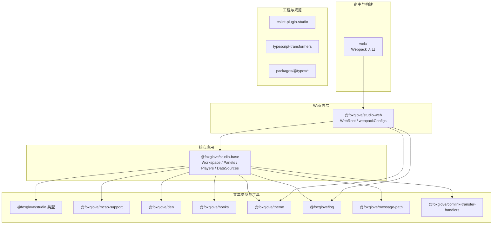
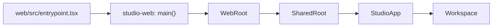
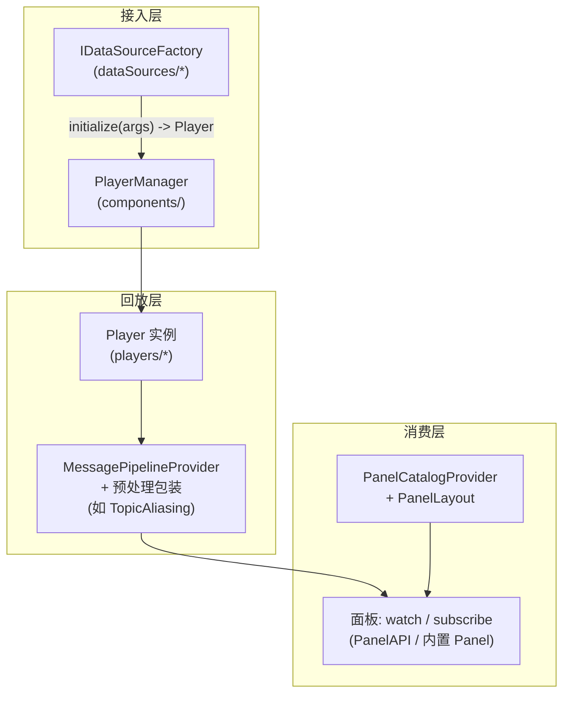
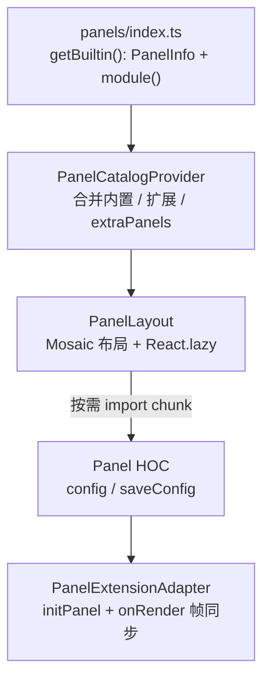
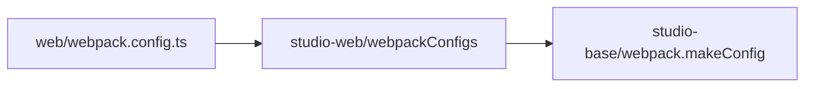

# Foxglove Studio：模块梳理与架构图（快速熟悉）

本文档面向**第一次打开仓库**时的导航：说明 Monorepo 各包职责、`studio-base` 内部模块划分，并用 **Mermaid** 画出分层与数据流。更深的数据源/MCAP/3D 面板细节见仓库根目录的 [`ARCHITECTURE.md`](./ARCHITECTURE.md)。

---

## 1. 项目是什么

这是 **Foxglove Studio** 的源码仓库：基于浏览器的机器人/传感器数据可视化与回放工具。技术栈以 **React 18 + TypeScript + Webpack** 为主，通过 **Yarn 3 Workspaces** 管理多包；**核心业务几乎都在 `packages/studio-base`**，Web 壳层在 `packages/studio-web` + `web/`。

---

## 2. Monorepo 工作区一览

根目录 `package.json` 的 `workspaces` 包含 `packages/*`、`packages/@types/*`、`web`、`benchmark`。各包角色如下。

| 路径                                  | NPM 包名（若有）                      | 职责简述                                                                                                 |
| ------------------------------------- | ------------------------------------- | -------------------------------------------------------------------------------------------------------- |
| `web/`                                | `web`                                 | Web **构建入口**：`webpack.config.ts` 拉取 `studio-web` 的 webpack 配置，实际打出浏览器产物。            |
| `benchmark/`                          | （私有）                              | 性能基准页的 webpack 工程，独立入口。                                                                    |
| `packages/studio-web/`                | `@foxglove/studio-web`                | **Web 应用壳**：兼容性提示、默认数据源注册、`WebRoot`/`SharedRoot`、复用 `studio-base` 的 `makeConfig`。 |
| `packages/studio-base/`               | `@foxglove/studio-base`               | **应用主体**：Workspace、面板、数据源工厂、`Player`、消息管线、绝大部分 UI 与业务逻辑。                  |
| `packages/studio/`                    | `@foxglove/studio`                    | **跨包共享类型/轻量 API**（可被其他包引用）。                                                            |
| `packages/mcap-support/`              | `@foxglove/mcap-support`              | MCAP **Schema / Protobuf 等解析**共用逻辑（如 `parseProtobufSchema`），供 `studio-base` 等使用。         |
| `packages/den/`                       | `@foxglove/den`                       | **内部孵化库**：Worker/Comlink、URDF 等与 Studio 强相关但可独立演进的工具代码。                          |
| `packages/hooks/`                     | `@foxglove/hooks`                     | 共享 React Hooks。                                                                                       |
| `packages/theme/`                     | `@foxglove/theme`                     | MUI **主题**封装。                                                                                       |
| `packages/log/`                       | `@foxglove/log`                       | 日志抽象。 \*                                                                                            |
| `packages/message-path/`              | `@foxglove/message-path`              | 消息路径解析等工具，供面板与表达式使用。                                                                 |
| `packages/comlink-transfer-handlers/` | `@foxglove/comlink-transfer-handlers` | Comlink **可转移类型**处理，配合 Worker 管线。                                                           |
| `packages/typescript-transformers/`   | `@foxglove/typescript-transformers`   | TS **编译期** 定制 transformer（工程用）。                                                               |
| `packages/eslint-plugin-studio/`      | `@foxglove/eslint-plugin-studio`      | 本仓库 **ESLint 规则**。                                                                                 |
| `packages/@types/*`                   | 多个 `@types/*`                       | 第三方或内部类型的 **DefinitelyTyped 风格补全**。                                                        |

\* `log` / `hooks` 等包在 `package.json` 中未写 `description` 时，上表按代码用途归纳。

---

## 3. `studio-base` 内部模块（目录地图）

路径前缀：`packages/studio-base/src/`。

| 目录/文件                        | 说明                                                                        |
| -------------------------------- | --------------------------------------------------------------------------- |
| `StudioApp.tsx`                  | 根应用：Provider 栈 + 挂载 `Workspace`。                                    |
| `Workspace.tsx`                  | 主工作区：布局、工具栏、面板区域等。                                        |
| `SharedRoot.tsx`                 | 与宿主共享的上下文入口（数据源、`extraProviders` 等由 `studio-web` 注入）。 |
| `components/`                    | 通用 UI、布局子组件、`PlayerManager` 等。                                   |
| `panels/`                        | **内置面板**（3D、Plot、Map、Image…）及 `ThreeDeeRender` 等重量级实现。     |
| `PanelAPI/`                      | **扩展面板 API**（外部/插件形态对接）。                                     |
| `dataSources/`                   | **数据源工厂**（本地 bag、MCAP、WebSocket、Remote、Sample…）。              |
| `players/`                       | **Player 实现与抽象**（含 `IterablePlayer`、各类 Source、Worker 包装）。    |
| `context/`                       | React Context 类型与 **Player 选择**等上下文定义。                          |
| `providers/`                     | **`PanelCatalogProvider`**、布局、主题、时间轴等 Provider 实现。            |
| `services/`                      | 布局迁移、扩展安装等服务层逻辑。                                            |
| `screens/`                       | 全屏级界面片段（按产品流程拆分）。                                          |
| `hooks/`                         | 业务侧 hooks（与 `packages/hooks` 区分：此处偏应用内）。                    |
| `i18n/`                          | 国际化资源与说明。                                                          |
| `theme/`、`styles/`              | 应用内样式与主题扩展。                                                      |
| `types/`、`typings/`             | 类型与全局声明补充。                                                        |
| `util/`、`constants/`、`assets/` | 工具函数、常量、静态资源。                                                  |

---

## 4. 架构图（Mermaid）

### 4.1 Monorepo 分层与依赖关系

依赖方向：**`web` → `studio-web` → `studio-base`**；`studio-base` 再依赖多个 workspace 工具包与 `@foxglove/studio` 等类型/共享包。

`Tooling` 子图中的包不随运行时 bundle 进入用户浏览器，主要用于 **lint / 编译 / 类型补全**。

### 4.2 Web 启动与 UI 挂载链路

从浏览器入口到主界面：

含义简述：`WebRoot` 组装默认 **数据源工厂** 并交给 `SharedRoot`；`StudioApp` 叠放各类 **Provider**，最后渲染 **Workspace**（布局 + 面板 + Player 相关 UI）。

### 4.3 数据流：数据源 → Player → 消息管线 → 面板

以 **本地 MCAP** 为例：`McapLocalDataSourceFactory` 通过 **Worker** 驱动 `McapIterableSource`，再挂到 `IterablePlayer`（详见 [`ARCHITECTURE.md`](./ARCHITECTURE.md) 第 4.1.2 节）。

### 4.4 面板加载（懒加载与 Catalog）

### 4.5 构建链（Webpack）

---

## 5. 建议阅读顺序

1. **本文档**：建立「有哪些包、`studio-base` 里有什么」的心智模型。
2. **[`ARCHITECTURE.md`](./ARCHITECTURE.md)**：数据源协议、`PlayerManager`、MCAP 全链路、**Panel / 3D** 深度说明。
3. **按需深入**：改数据源看 `dataSources/` + `players/`；改 UI 看 `components/` + `Workspace`；改 3D 看 `panels/ThreeDeeRender/`。

---

## 6. 本地常用命令（速查）

| 命令                  | 作用                                              |
| --------------------- | ------------------------------------------------- |
| `yarn web:serve`      | 启动 Web 开发服务（Webpack dev server）。         |
| `yarn build:packages` | 构建各 package 的 TypeScript project references。 |
| `yarn web:build:prod` | 生产构建 Web。                                    |
| `yarn test`           | 运行 Jest。                                       |

具体脚本以根目录 `package.json` 的 `scripts` 为准。
